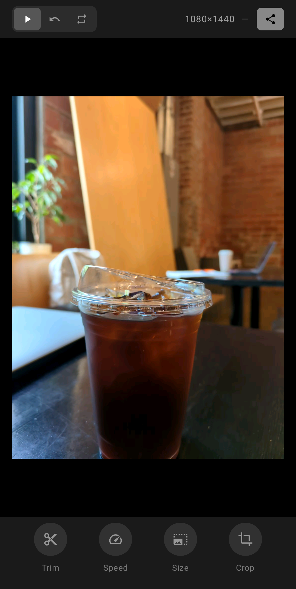
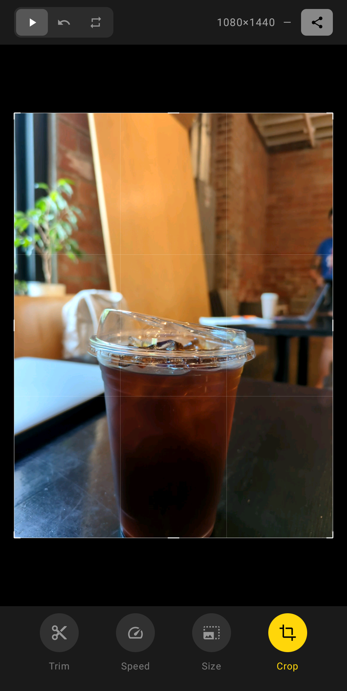
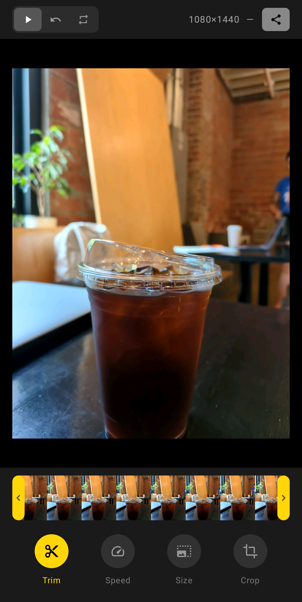

# Giffer for Android

Convert Android **Motion Photos** (Google / Samsung / legacy Micro Video) into animated GIFs.
A Kotlin + Jetpack Compose port of the iOS Giffer app.

## Features

- Trim, adjust speed (6–24 fps), resize, and crop
- Playback: forward, reverse, bounce
- Live preview while editing + estimated file size
- 100% on-device — nothing leaves your phone

## Screenshots

Captured on a Pixel 5 by the `EditorUiScreenshotTest` running on Firebase Test Lab, against a
real Pixel Motion Photo.

| Editor | Crop | Trim |
| --- | --- | --- |
|  |  |  |

## How it differs from the iOS app

iOS Live Photos store the still and the video as two separate resources of one library
asset. Android instead appends an MP4 *inside* the single picked image file. So where the
iOS app grabs the paired `.mov` resource, the Android app locates and slices the embedded
MP4 out of the image bytes (`MotionPhotoExtractor`), using Jetpack Media3's
`MotionPhotoMetadata` with a raw byte-scan fallback for Samsung. See
[RESEARCH.md](RESEARCH.md) for the full format breakdown.

There is also no GIF encoder in the Android platform (iOS has ImageIO), so the app bundles a
pure-Kotlin GIF89a encoder (NeuQuant quantizer + LZW) under `service/gif/`.

## Project layout

```
app/src/main/java/com/leaptools/giffer/
  model/        GifConfiguration, PlaybackMode, EditorTool
  service/      MotionPhotoExtractor, GifEncoder, SizeEstimator
  service/gif/  AnimatedGifEncoder, NeuQuant, LzwEncoder
  viewmodel/    EditorViewModel
  ui/           PickerScreen, EditScreen, GifPreview, CropOverlay, TrimSlider, AboutScreen
```

## Building & testing

You do **not** need Android Studio. See [SETUP.md](SETUP.md) for a minimal command-line
toolchain (JDK 17 + Android command-line tools) and how to run an emulator on a Linux server.

```bash
./gradlew assembleDebug      # build the APK
./gradlew testDebugUnitTest  # run unit tests (Robolectric)
./gradlew installDebug       # install to a connected device/emulator
```

### Testing without a local emulator

- **[FIREBASE.md](FIREBASE.md)** — automated extraction + UI-screenshot tests on real Firebase
  Test Lab devices (`./firebase-test.sh`).
- **[REMOTE.md](REMOTE.md)** — a persistent emulator + build server on a home server (panoramix),
  reachable over Tailscale: build on the Mac, run on the server, watch it in a browser
  (`./remote-build.sh`).

## License

[MPL-2.0](../LICENSE) © Peter Fajner. The bundled GIF encoder derives from Anthony Dekker's
NeuQuant and Kevin Weiner's public-domain `AnimatedGifEncoder` (see headers in
`service/gif/`).
